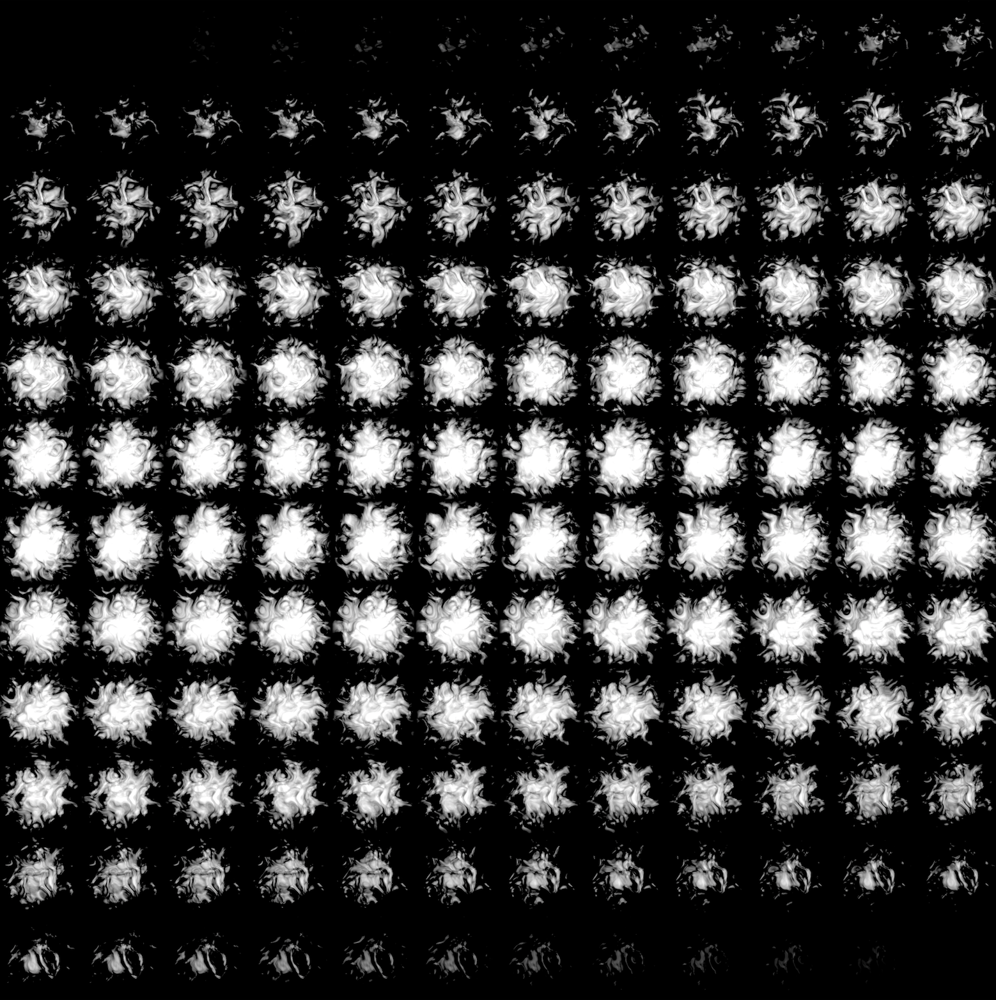

# Ray Tracer
Ray tracer written using C++ with SDL.

# Build options
In order to compile and run the ray tracer
  * Compile with GNU C++ compiler which supports C++17.
  * OpenMP must be installed in the default path.
  * To run type `make run`

# Some Features
## Volumetric Rendering
Performs ray marching to simulate volumes. The image below shows the result of stacking the sprites in a 2d sprite sheet. The sprites are interpolated between to calculate the density of the volume at a 3d position.

## Texture Mapping
Textures can be projected into primitives using either planar or spherical mapping. The image below shows a Jupiter texture spherically projected onto a sphere primitive.

## Procedural Noise
Noise can also be generated procedurally in either 2D or 3D. 

## Primtives
The ray tracer supports ray intersections with triangles, spheres, or rings. Spheres and rings are demonstrated in the image below.

## Gravitational Lensing
Bending of light due to gravity can be simulated using a gravitational lens shader. 

